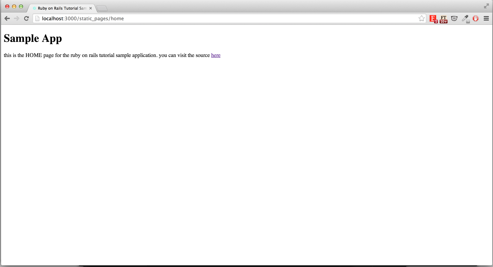
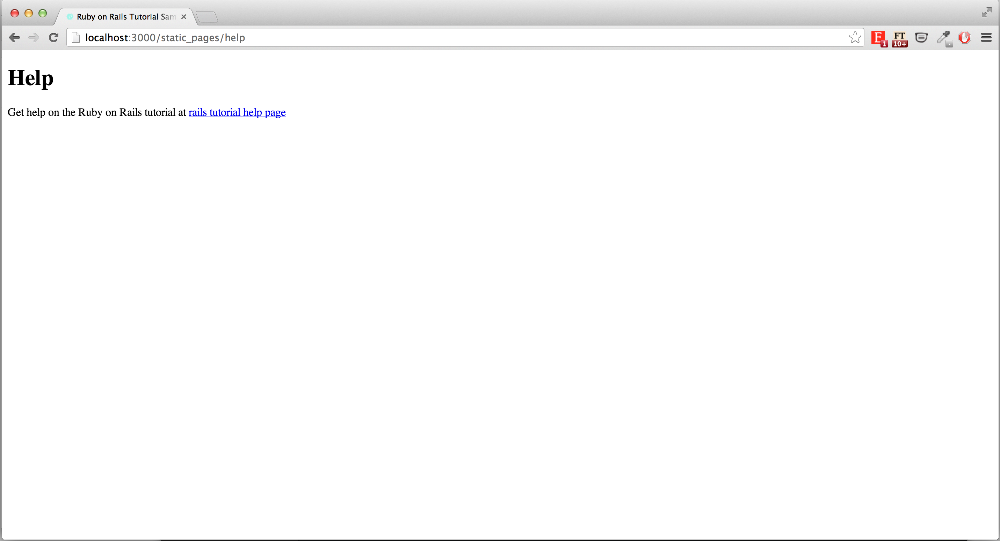
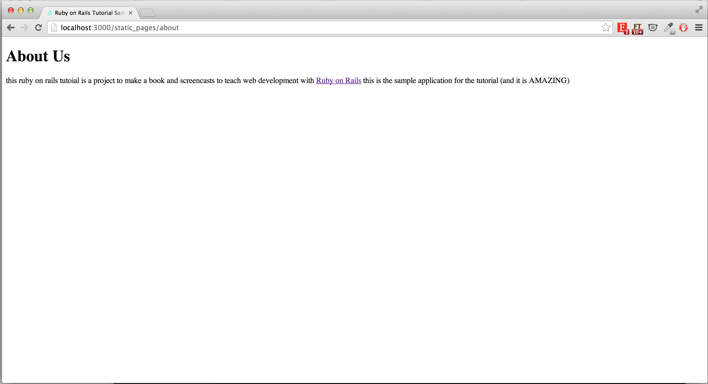

##Michael Hartl Ruby on Rails Tutorial Chapter 3

This is an extra task that I took on in order to gain more experience in Ruby on Rails. The goal of this extra task was to understand the different files/directories and command prompts that are specfic to Ruby on Rails.

The task in this chapter was to build static pages for home, help and, about.

The task can be found [here](http://railstutorial.org/) in the third chapter.

## 

### Static Home Page

### Static Help Page

### Static About Page

##Stack:
- Ruby
- Ruby on Rails
